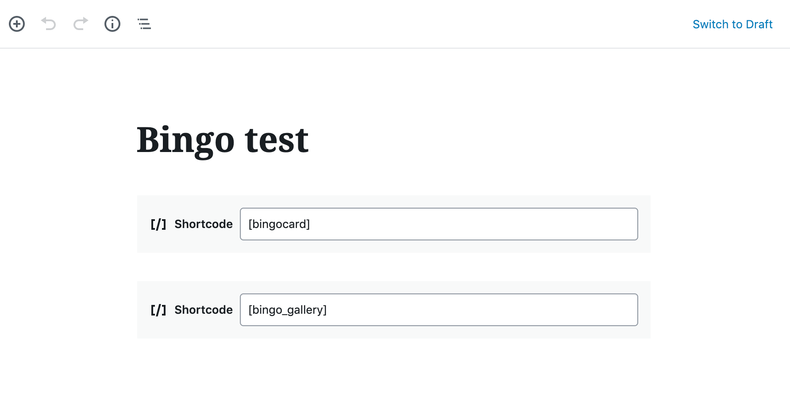

# Bingo Card Plugin

* This plugin is for implementing bingo cards on WordPress posts and custom post types.
* Version 1.1

The Bingo Card Plugin is supported on WordPress 4.8 and above. The plugin is powered by vanilla JavaScript and CSS, no additional libraries required.

**Warning**: installing WordPress's <a href="https://jetpack.com">Jetpack plugin</a> has been known to cause errors. This plugin may have conflicts and not work as expected.

### About the author

Alexandra White is an occasional WordPress developer, who built this plugin while working at WNET.

## Required assets

For each Bingo board you should have the following images:

* 24 or more "bingo cards" uploaded directly to your post. These should be square images, either JPG or PNG. I recommend size 150px x 150px.
* 1 free space image. This should be the same size as the bingo cards.
* 1 bingo header image, width 650px
* 3 winner images. Recommended size 500px x 300px

There are now demo images available in the folder `/demo`. Upload the images in `/demo/bingo-cards` directly to your WordPress post. The other images should be uploaded directly to the Media gallery.

## Instructions

1. Upload the Bingo Plugin on your WordPress installation.
1. Activate the plugin.
1. Create a post and add the two shortcodes `[bingocard]` `[bingo_gallery]`
   + If using the Gutenberg editor, you must use a **Shortcode** block for each shortcode.
   + If using the Classic editor, add the two shortcodes with a line break in between them.
1. Upload at least 24 bingo card images for Bingo directly to your post. Images should be square.
   + If using the Gutenberg editor, add an image block and click the **Media Library** button.
   + If using the Classic editor, click the **Add Media** button above the WYSIWYG.
   + DO NOT upload the featured image, free space image, or winner images directly to the post. Any photo uploaded to the post will be in rotation on the bingo card.
   + DO NOT include the images in the body of the post. The images should be attached to the post without being seen.
   
1. Upload the remaining images (free space, winner cards, featured post image, etc) directly to the Media Library.
1. Go to Settings > Bingo Card Settings
1. Add the post ID for your bingo card will to "Bingo Card 1 Post ID".
1. (Optional) add a header image URL to your bingo card. If this step is not completed, a default image will be used.
1. Add the free space image URL for Card 1. If this step is not completed, a default image will be used.
1. Add winner card image URLs to be used for social media sharing.
1. Save the settings.

Repeat these steps for up to three posts.

